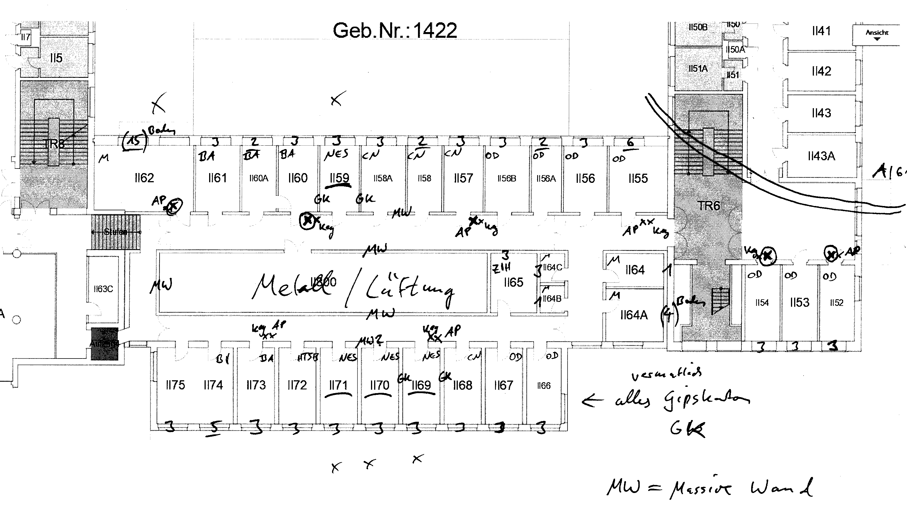
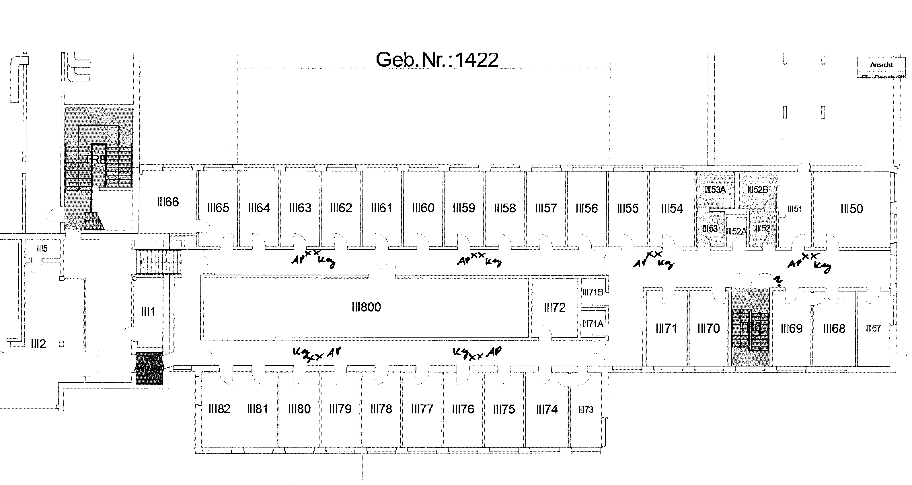

# Concepts for TU Dresden & ZIH

## Administrative Info

- ZIH offers hosting of (self provided) physical server and virtual ones
    - see ZIH Server-FAQ Link below
    - phyServer: gets power, ethernet, USV, cooling, ...
    - vServer: preferred by ZIH, free of charge, 3-5 Days prepare -> vServer-SelfService link below
    - ZIH offers Sub-Domains on Website -> SubDomain-FAQ link below
    - extended storage can be requested for research-groups: Gruppenlaufwerk link below
- ZIH-Rules for using their infrastructure
    - central dhcp: only by IT-Admin of facility -> DHCP-FAQ link below
    - network access: IT-Admin [FAQ](https://tu-dresden.de/zih/dienste/service-katalog/arbeitsumgebung/bereitstellung_datennetz)
    - see cfaed IT-Admin link below
    - WIFI interference und network capability undocumented online
- Answer to inquiry, from IT / ZIH
    - we could use right side of nw-sockets (currently mostly unpatched) -> TODO: talk with the leaders of groups that occupy offices
    - vLAN and DHCP from ZIH
    - we could use the server-room in BAR
    - ZIH offers more powerful vServers than listed on website
    - distribution plan shows that patch-cables of the floor all end in the same patch-room (BAR II65 S2/S3)
        - if switches do not meet our standards we can provide our own, needs to be a supported cisco model
        - if even that does not suffice it will get a lot harder -> bringing new cable / devices into the wall is a structural change with a whole book of needed permissions
    - if LAN-Sockets do not suffice, we can use a (cisco-)switch locally in offices
    - unix-nodes should host fusion-inventory (to scan for vulnerabilities)
    - hardware > 150 € needs to be in inventory (sticker & database listing)
    - vServer gets monitored / managed with Centreon
        - for access from outside (internet) the server needs a security-concept
    - passwords and access-data should be managed with "TeamPass" -> password manager for groups

**Link-Sammlung**:

- Server-FAQ: <https://tu-dresden.de/zih/dienste/service-katalog/zusammenarbeiten-und-forschen/server_hosting>
- DHCP-FAQ: <https://tu-dresden.de/zih/dienste/service-katalog/arbeitsumgebung/zentrale_ip_adressverwaltung>
- SubDomain-FAQ: <https://tu-dresden.de/zih/dienste/service-katalog/arbeitsumgebung/domains-dns/management>
- IT-Admin: <https://cfaed.tu-dresden.de/it-support>
- vServer-SelfService: <https://selfservice.zih.tu-dresden.de/l/index.php/cloud_dienste>
- Floor-plan: <https://navigator.tu-dresden.de/etplan/bar/02>
- Gruppenlaufwerk: <https://selfservice.zih.tu-dresden.de/l/index.php/spor/request-form/>

## RF-Measurement

- sender was a nRF52840-DK Board with BLE Beacon example, 1 MBit,
    - tx power - 16 to 8 dBm, in this case 0 and 8 dBm
    - rx sensitivity is - 97 dBm
- receiver was a phone, oneplus 3T, with visualisation of rx-power,
    - rx sensitivity down to - 100 dBm
    - path loss in direct proximity was about 50 dB
- measurement-mode: determine max range while using link-budget and keeping stable connection
- results for 0 dBm
    - range was about 4 offices (horizontal) with dry-wall in between
    - was not able to get to upper floor
    - no signal through II800
- results for 8 dBm
    - range is about 7 offices (horizontal) with dry-wall in between
    - packets reached upper floor, even the adjacent office next to the direct overlying one
    - no signal through II800, not even with direct wall contact (these are massive walls, with massive metal / ventilation parts inside
- with active use of II64 / II64B / II64C it would be possible to get a U-Shaped network
- see "2020-12-15_rf_measurements.ods" for protocol

## Netzkonzept für das ZIH

- Projektbeschreibung
    - Prüfstand für Funknetzwerk-Algorithmen, speziell im Bereich Energy-Harvesting
    - Nachbildung verschiedener Funktopologien und Energie-Szenarien
- Start des Projekts
    - 01.02.2021 (falls ein direktes Datum benötigt wird)
    - es läuft bereits, daher so bald wie möglich
- Projektlaufzeit
    - drei Doktoranden benötigen das Projekt für ihre Forschung für 3-5 Jahre
- Gerätetypen, Menge, Kategorien
    - ~ 30 autonome Funkknoten mit Netzwerk-Backchannel, Basis sind Beaglebone Green, Einplatinenrechner mit Linux / Debian-Derivat
    - die ersten 10 Testknoten sind bereits einsatzfähig
    - die Linux-Knoten haben ihr eigenes vLAN und wurden gegen Zugriff abgesichert (keine offenen Ports, kein UART, starke PW)
    - Kategorisierung am ehesten als Laborgerät?
- Einsatzort
    - Verteilung der Knoten auf der unteren cfaed-Etage im Barkhausen Bau
    - mehrere Räume, BAR II52 - II75
    - einige Knoten auf den Fluren, Kopierraum, Postraum, Konferenzraum
    - Problem: durch den großen Lüftungsraum II800 wird das Funknetzwerk sehr fragmentiert, sodass ein Nutzen oben angesprochenen Räume wünschenswert ist
- Schutzbedarf
    - Geräte zeichnen nur Energieverläufe der Funkknoten und deren GPIO-Traces auf
    - keine sonstigen Sensoren werden ausgewertet
    - keine Nutzerbezogenen Daten
- Dienste, Zugriff
    - Koten befinden sich in eigenem vLAN,
    - Knoten bauen SSH-Verbindung (Port 22) zum virtuellen ZIH Kontroll-Server auf um Roh-Messdaten zu übertragen
    - PTP (Port 319/320) zur Synchronisierung der Knoten untereinander, t_delta <= 100 ns
    - Internet-Zugriff für die Knoten wäre wünschenswert (für Updates, bzw. für die Einrichtung)
- Funknetzwerk des Prüfstandes
    - RF Netzwerk befindet sich im 2.4 GHz ISM-Band, bleibt innerhalb der ETSI-Norm, hauptsächlich IEEE 802.15.4, beispiel Bluetooth
    - Bluetooth belegt 81x 1 MHz breite Kanäle von 2400 - 2480 MHz und benutzt Frequency-Hopping, d.h jedes Paket wird auf einem anderen Kanal gesendet, mehrere tausend Sprünge pro Sekunde
- Besondere Anforderungen
    - Ethernet-Rückkanal der Knoten braucht Unterstützung für GBE, PoE, wenn möglich PTP nativ im Switch
    - im Bestfall wäre PoE abschaltbar (vom Kontrollserver) um das Netzwerk auszuschalten (Energiesparen), oder einzelne Knoten neuzustarten
    - PTP-Anforderung: Synchronisationsabweichung << 1 us zwischen den Knoten, optimal wären 10-100 ns
- wir sind offen für alle administrativen bzw. Sicherheits-Auflagen die notwendig sind zur Erfüllung der Anforderungen

## Gesprächsprotokoll mit dem ZIH-Treffen

- unsere Anforderungen wurden kommuniziert und angenommen, Punkte die mehr diskutiert wurden sind hier angeführt
- Cisco-Wifi-Router
    - das ZIH hat ein temporäres (sowie dauerhaftes) Abschalten von WLAN im 2.4 GHz Band auf der Etage angeboten
    - wir würden das Angebot gerne Annehmen, aktuell halten wir beispielsweise ein regelmäßiges Scheduling für Samstag / Sonntag ab sinnvollsten
    - betroffene sechs Router (+NW-Dose)
        - BAR-AP-A-II52 (II65_S2_K_21)
        - BAR-AP-A-II56 (II65_S2_K_13)
        - BAR-AP-A-II57 (II65_S2_J_7)
        - BAR-AP-A-II62 (II65_S2_H_13)
        - BAR-AP-A-II69 (II65_S3_B_15)
        - BAR-AP-A-II73 (II65_S3_C_17)
- zu beschaltene NW-Dosen
    - Laut Aussage vom ZIH dürften wir (mit niedrigster Priorität) ebenfalls NW-Dosen auf den Fluren bzw. öffentlich genutzen Räumen benutzen
    - siehe Liste unter <https://github.com/orgua/shepherd_v2_planning/blob/master/10_cfaed_ethernet_ports.ods>
    - Dosen bleiben weiterhin normal benutzbar, da vLAN per MAC-Filter funktioniert
- Kontrolle über POE
    - laut ZIH denkbar, wenn ein dedizierter Switch für den Prüfstand zum Einsatz kommt
- PTP-Zeitsynchronisation
    - laut ZIH optimal, wenn ein dedizierter Switch für den Prüfstand zum Einsatz käme
    - Jitter der Switches unter geringer Last angeblich sehr gering, im Datenblatt spezifiziert

## Entwicklung zur Infrastruktur (2021-01-29)

- Switch vom ZIH gestellt und gemanaged - WS-C2960X-48FPD-L
- 10 GBit Uplink zum Server, wenn Port frei ist (ist er)
- Nur NES-Lab-Netz auf den gewünschten Dosen
- Switch erlaubt POE mit insgesamt 740 W, also 40 Geräte a 15 Watt sind abgedeckt, BB brauchen ~3 W
- POE nicht dynamisch vom Server schaltbar, sondern nur händisch von IT
- PTP nicht nativ vom Switch unterstützt, aber der ist später austauschbar (Eigenleistung von uns)
- Dosen im öffentlichen Raum weiterhin generell ok, aber explizit untergeordnet und erst nach Begehung mit OK vom ZIH

- 10 TB Gruppenlaufwerk
    - self-service, funktionslogin
    - dom.ts.[].zih.... - account hinzufügen, admins volle Rechte, mehr Gruppenmitglieder hinzufügen
    - zugangsdaten im tu-passwortspeicher ablegen
    - einbinden über fstab als smb-lw, spezielle root-rechte
- Server Roadmap
    - mit fake ssl zum laufen bekommen
    - self service -> sicherheits-prüfung kontinierlich durchgeführt
    - subdomain shepherd.cfaed. ... beantragen
    - ssl-zertifikat anfordern (anleitung ZIH) -> kein pW-Schutz beim private Key, sonst ist bei jedem boot ein PW erforderlich
- Webseite
    - Barrierefreiheit und Impressum, sonst keine Weltweite freigabe (und ssl-force, subdomain)

## Anforderungen

- vLan
    - Zugriff vom Kontroll-Server aus, SSH (TCP Port 22)
    - Internet-Zugriff der Knoten für Linux-Updates
    - maximale Größe 45 Geräte
    - Campusgeroutet, ...
    - autorisierte MAC-Adressen landen automatisch im vLAN
    - TODO: MAC-Adress-Liste
- vServer als Kontroll- und Web-Interface
    - (die engen Zeitsynchronisierungsvorgaben gelten hier nicht)
    - Software die benötigt wird: Debian Linux Derivat, python 3.7+, ansible
    - >>100 GB scratch-area
    - Port 80 erreichbar aus dem Internet für Web-Interface, im Bestfall mit Sub-Domain oder eingebettet in CFAED-Seite
    - Personenbezogene Daten: später werden für die User-Accounts eventuell Email-Adressen gespeichert, eventuell umgehbar mit OAuth
- Cisco-Wifi-Router
    - das ZIH hat ein temporäres Abschalten von WLAN im 2.4 GHz Band angeboten
    - wir würden das Angebot gerne Annehmen, aktuell halten wir beispielsweise ein regelmäßiges Scheduling für Samstag / Sonntag ab sinnvollsten
    - betroffene sechs Router (+NW-Dose)
        - BAR-AP-A-II52 (II65_S2_K_21)
        - BAR-AP-A-II56 (II65_S2_K_13)
        - BAR-AP-A-II57 (II65_S2_J_7)
        - BAR-AP-A-II62 (II65_S2_H_13)
        - BAR-AP-A-II69 (II65_S3_B_15)
        - BAR-AP-A-II73 (II65_S3_C_17)
- zu beschaltene NW-Dosen
    - Laut Aussage vom ZIH dürften wir (mit niedrigster Priorität) ebenfalls NW-Dosen auf den Fluren benutzen
    - siehe Liste unter <https://github.com/orgua/shepherd_v2_planning/blob/master/10_cfaed_ethernet_ports.ods>
    - Dosen bleiben weiterhin normal benutzbar, da vLAN per MAC-Filter funktioniert
- NW-Switch in Raum II65
    - GBE (maximal benötigte Geschwindigkeit)
    - optimal ist ein dediziertes Gerät mit >= 40 Ports -> Ziel: sehr geringer Jitter bei PTP-Zeitsynchronisierung der Knoten
    - vLan-Zugriff für Knoten
    - wenn möglich Kontrolle über POE der Ports zum Energiesparen, da embedded Knoten zwar runtergefahren werden können, aber kein WOL beherrschen

## Anbringung der Knoten

- controlled by: https://tu-dresden.de/tu-dresden/organisation/zentrale-universitaetsverwaltung/dezernat-4-gebaeudemanagement/sg-4-1-baumanagement/bautechnik
- formular:  https://www.verw.tu-dresden.de/VerwRicht/Formulare/download.asp?file=Baubedarfsblatt.pdf

- die Projektlaufzeit beträgt etwa 3-5 Jahre
- die 30 Testknoten benötigen als Verbindung lediglich jeweils ein LAN-Kabel
- Das Gehäuse kann entweder flach oder würfelförmig werden, das benötigte Volumen beträgt etwa 0.5 Liter
- Das enthaltene System verbraucht etwa 3-5 W bei Aktivität (5V), bedeutet also keine signifikante Wärmequelle
- wir beschränken uns auf die cfaed-Etage mit den Räumen BAR II52 - II75
- in der Auswahl sind hauptsächlich Büros, Kaffeeküche, Postraum, ein Konferenzraum und einige Flur-Positionen
- wir haben das OK von den Lehrstühlen, bzw. der Bürobesetzung und vom ZIH
- das ZIH hat bereits ein Subnetz für uns geschaltet

## Anforderungen zur Anbringung

- Genehmigung der Bundesnetzagentur (Funk)
    - wir operieren im ISM-Band und halten uns an die geltenen Bestimmungen, bzw. nutzen wir OEM / off-the-shelf-Funk-Module, zertifiziert
- Einzeichnung Standorte in Grundrisse
    - Standorte müssen noch ermitteln werden
- Zustimmung der aktuellen Nutzer ist schriftlich vom Kostenstellenverantwortlichen zu zeichnen
- Standorte im Flur und der Küche -> separater Antrag an das Sachgebiet 4.3
- ggf. Brandschutzbewertung notwendig -> Kostenstelle in Höhe ca. 1-1,5 TEuro benötigt
    - Formular von Herrn Heyner
- formloses Betreiberkonzept
- Gefährdungsbeurteilung ist mit der Arbeitssicherheit SG 4.5 abzustimmen

## Plan zur Anbringung

- Gehäuse
    - Elektronik nicht anfassbar, aber Belüftung möglich
    - keine leicht entflammbaren Materialien
- Betreiberkonzept Vorentwurf
- mit SG 4.3 in Verbindung setzen
- mit SG 4.5 in Verbindung setzen

