# Cape v2.3 - Performance

## Tested

- WD is fine now ⇾ Board gets turned on
- BB boots with Shephard Cape on
- BB-powered boot works, but turning Cape on crashes the 5V Rail (P9-7/8)
- WD restarting BB works

## Troubleshooting

### Profiling Ranges

- full range: 0 to 5V, 0 to 50 mA
- limited range: 1 to 3.9 V, 3uA to 40mA

### Harvester - low current measurement-limit

- draining below 1-2 uA ⇾ voltage seems to invert (SMU reports -0.3V), not caring about the set-voltage of the DAC
- adc-current values are equal to "zero"
- diode blocks (later tests show 2nA reverse current), because voltage at cathode (opAmp-Out) is similar high to DAC-Voltage
- something seems to reverse leak current ⇾ tldr: it is the OPA189 Negative Input Pin
    - **OPA189 input** can leak max +-1 nA (input bias current) and differential input impedance is 100 MOhm (100nA to 10V)
    - AD8421 inputs can leak max 2x +-500 pA, tests show < 1 nA
    - OPA2388 input can leak max +-400 pA (spec), tests show < 1 nA
    - diode is rated for 40 nA but shows in tests 2 nA @ 5V (see picture below)
    - capacitor C34 (Opa-Feedback) could leak ⇾ tests show < 1 nA @ +-5V-Range (see picture below)
    - and the op189 output ⇾ not relevant due to safe diode and capacitor
    - removing R20 stops the leak ⇾ hint at OPA189 or cap C34
    - removing C34 changes nothing ⇾ final clue for OPA189
- that may never occur with a real harvesting source (or work as a hard-to-detect offset)
- baking pcb off (80 °C, 30min) had no effect (mentioned in datasheet)
- this leakage is often not existent when SMU is freshly started for the day ⇾ firmware-update to 3.4.0 (2021-04, from 3.2.2 2016-04) did not help
    - see profile 25, whole voltage range, down to 0 uA
- changing R20 (Feedback-Lowpass) to 100R or 10k does not change behavior
- tests with solar-cell (SM101K09L) shows that 2uA is near to dark environment
- old TODO:
    - reverse position of diode and shunt
    - OPA189 speaks of (8.3.3) input bias current clock feedthrough (switching input to correct intrinsic offset)
    - ⇾ it seems to be the "zero-drift" feature of OPA189 that gets triggered wrongly
    - worst outcome: 1-2 uA offset in measurement
- Update: this problem went away by using another py-lib for the SMU (and cleaner, more explicit init)

Schematic of Harvester v2.3

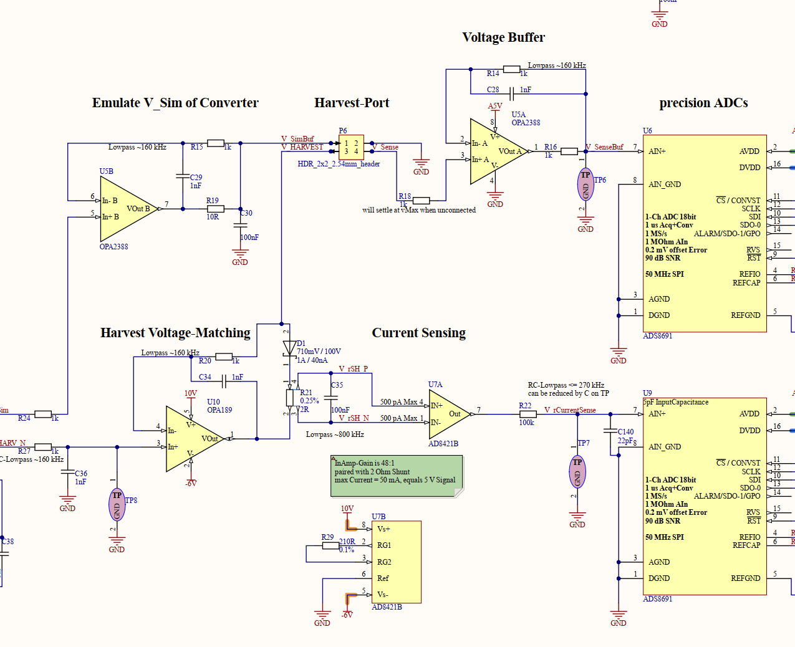

Current Leakage for Capacitor 1nF (C0G)

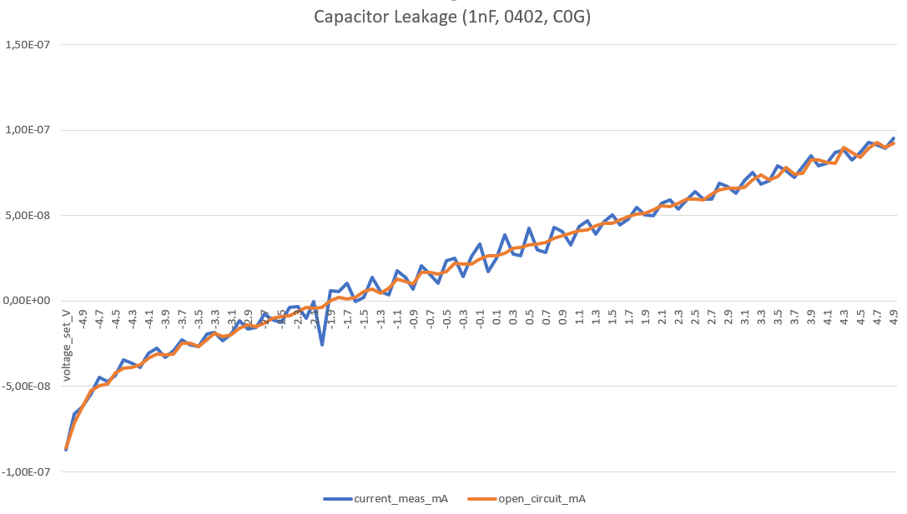

Current Leakage for Harvest Port

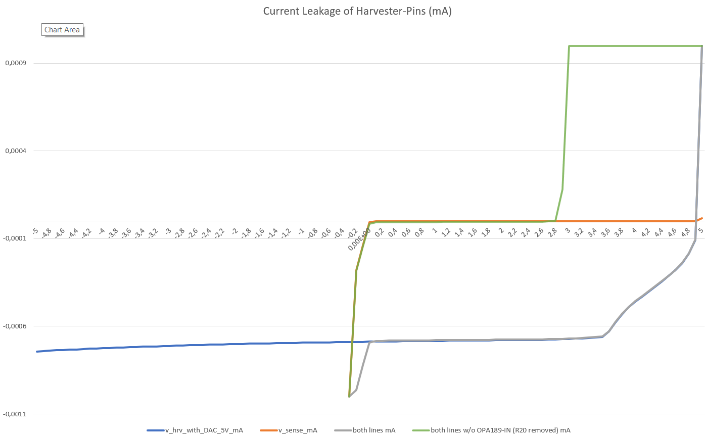

Power from Solar Cell (SM101KO9L) in various conditions

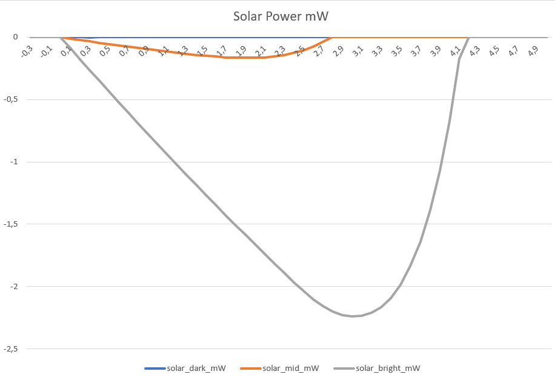

## Diode Comparison

- PMEG10010ELRX
    - rated for (extremely low leakage current) **4 nA @ 10 V & 25 °C** and 40 nA (typical, 150 nA max) at 100V & 25°C
    - measurement: -5 V result in **2.1 nA at room temperature**
    - seems the safest bet, because datasheet promises the spec
- SMMSD701T1G
    - rated for ~ 8-9 nA @ 6-12 V & 25 °C (curves in datasheet)
    - measurement: -5 V result in **1.4 nA at room temperature**
    - lowest leak-value but not distinguishable from PMEG-Version in Frontend
- RB168MM-40TR
    - rated for 50 (typical) to 550 uA reverse current @ 40 V
    - curves in datasheet show IR @ 5 V, 25°C at around 10 nA, up to 1000 nA at 75°C
    - measurement: -5 V result in **6.9 nA at room temperature**
- the first two diodes are fine!
- ⇾ see media_v23/profiler_smu_diodes.csv

### Reverse Current of Diodes

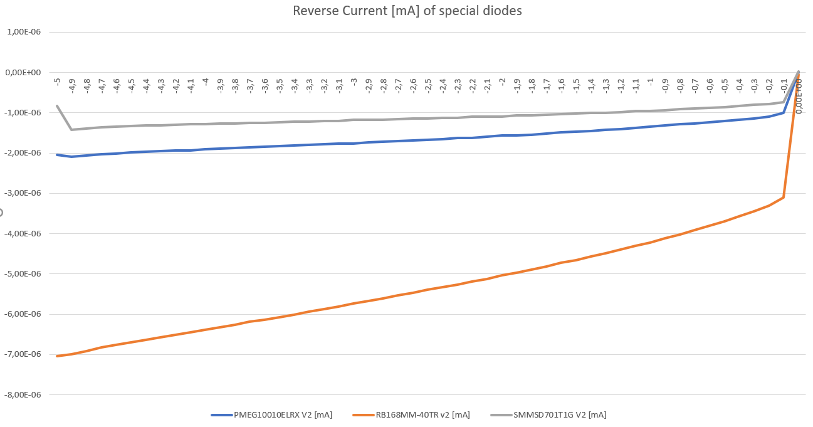

## Harvester - Current Measurement

- 2R-Shunt, Gain x48 ⇾ 10R Shunt, Gain x10
    - no significant effect from profiler
    - **keep synced to emulator to save parts**
    - **keep 2R-Shunt**
- Lowpass between InAmp and ADC
    - 100k results in high offset of > offset of 11'800 n for 0 nA (ADC input seems to be raised by ADC itself)
    - 1k results in offset = ~ 182 n (Good) and lower Noise, mostly on full range (3-14x better)
    - 100R seems to worsen limited area (slightly), but improve full range (almost x2)
    - Cap was varied to match 80 - 160 kHz lowpass, but influence is minimal
    - 0R caused trouble with voltage dependent current reading +-10uA from 0 to 5V
    - **33R / 10nF** is fine, limited range gets minimal worse, but full range improves
- buffered shunt (parallel cap C35)
    - 470 nF instead of nothing: 10 - 20% improvement on limited and full range
    - nothing instead of 100 nF: 5-10 % worse on full range, minimal better on limited range (but with 100 nF seems the better bet)
    - 100nF instead of nothing: ~10% improvement on both ranges
    - **later tuning showed almost no influence of the cap (0, 10, 100nF) only max_error gets limited in profiler**
    - **10nF does suffice!**
- buffered inputs (Caps on V_HRV and V_Sense)
    - adding 2x 100nF is ~ 10 % worse
    - **remove**
- different diode (try alternatives)
    - no significant effect between new (and better) SMMSD701T1G-Diode and (current) PMEG10010ELRX
- slower OpAmp-Feedback
    - R20, 10k instead of 1k or 100R: 10-12% improvement for both ranges, but only static case (lowpass 16 kHz)
    - later tuning showed that 100R (compared to 330, 1k) are preferred, because OpAmp has to be fast (for the nonlinearitiy, ie. in voltage sweeps
    - **faste OpAMp** is better, as long as stable
- DAC to OpAmp Connection
    - slower response helps measurement
    - current 1k & 1nF are fine ⇾ 9 us risetime from rail to rail (same with 200R, 1nF)
    - 100R & 10nF seem to perform a bit better
- shield
    - is not hurting the measurement, but helps with noisy environments
- set DAC-Ref-voltage to external A5V
    - current-reading improvement, while voltage worsened? but error stayed after reversing the change
    - TODO: investigate

## Harvester - Voltage Measurement

- bigger shunt Resistor is 5-10% worse
- C35 parallel to shunt is better than no Cap, 100 nF is fine, 10nF also
- R16 before ADC-V is better smaller, but filtering is also
- Cap before ADC-V is better, 10nF compared to nothing brings 10 % improvement
- R18 before OpAmp was 1k, removal brings 10 % improvement
- Caps 100nF on Pinheader-Inputs is 5-10 % worsening
- R20 low ⇾ Voltage-Matcher should be rather fast (better for V_meas, worse for C_meas)
- DAC-Lowpass is fine, lower Freq helps measurement

Without ShuntBuffer the current reading may be noisy (1k OpAmp Feedback, 0nF Shunt-Buffer)

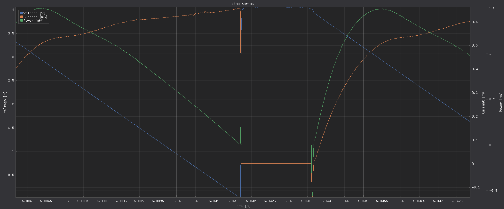

Improvement with 10nF ShuntBuffer

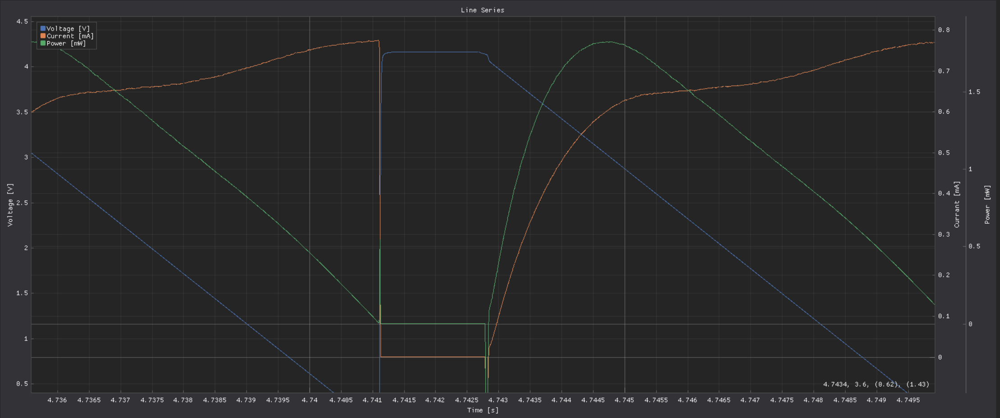

OpAmp is stable enough to lower FB to 100R ⇾ this gets rid of the nonlinearity in the sweep (area where open circuit voltage meets voltage ramp):

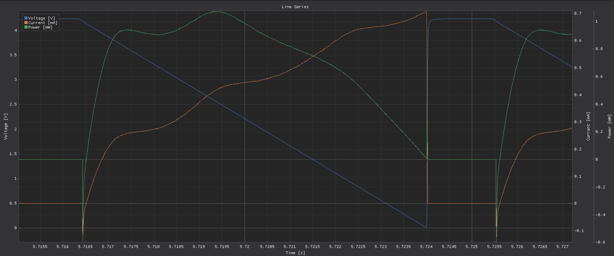

## Emulator

- can't produce 5 V with 50 mA
- even at 0 mA the limit of 5 V is not completely on point,
- at 50 mA around 4 V are usable without large error
- ⇾ seems to be fine for modern electronics
- 2 R Shunt resistor is responsible for 100 mV drop (50 mA)
- R10 from 100k changed to 0R ⇾ offset still around 15.x, similar as with 33R in harvester
- 5V-Voltage regulator needs at least +1V Input ⇾ raise 6v_Rail from 5.4V to 6.17V ⇾ Emulator improves to 50mA @ ~4.28V
- Opa388 seems to be worse than the Opa189 ⇾ switch to this one

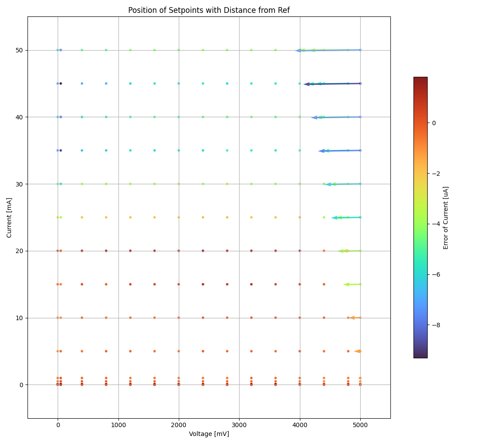

## BB-Powered Mode

- turning cape on when on BB-USB-Power crashes the system
- 5V_BB (P9-7/8) gets connected to 5V Line with inductor and large 1mF Cap
- most inductors show only minimal influence ⇾ remove them
- more capacity on power-line is better (A5V is most significant), see traces below

No additional Buffering on A5V-Line

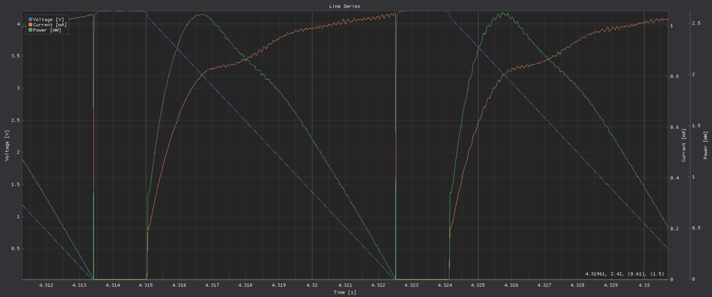

1mF Cap on A5V line - less noise!

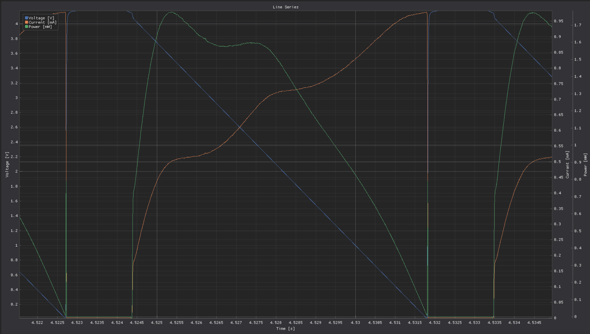

## Stabilize ADC-Readings

Plan: work through datasheet for more design guideline hints

- ADC ADS8691
    - use X7R caps for V_in and ref-pins
    - low impedance sense-input
- InAmp AD8421
    - VS with 100nF + 10uF
    - RG with minimized capacitance
    - connection to ADC: 100R + 3nF
    - ref-voltage with OP1177, with 5k feedback, no C, 10 uF buffer for OpAmp Input
    - low impedance connections, input can be buffered
- OpAmp Opa189
    - same as Opa388
    - seems more stable than opa388, fb-cap can be omitted
- OpAmp Opa388
    - shield / isolate from air-currents and heat-sources
    - place 100nF directly to pwr-in and use groundplane
- DAC8562
    - AVdd with 100pF, 1nF, 100nF, 1uF
    - VRef-Buffer, higher capacitance raises noise floor?
    - internal reference is more noisy (1.4 to 3x less noise with perfect external ref) ⇾ fail because voltage has huge error (current got more stable though)
- LDO LP2989
    - bypass cap 10nF C0G or NP0
    - provide VIn >= VOut + 1V
- Inverter LT3487
    - Thermal Pad (GND) low impedance, many vias
    - bypass with X7R
    - negative channel >= 10uF, pos Channel > 4.7 uF
    - phase lead caps for dampened load response (10-33pF parallel to FB-Res)
    - input can start at 1uF

## Noise-Reducing Experiments

- ADC: R10 33R, C62 10nF lowpass, 482kHz ⇾ not much difference?
- R8, 5k OpAmp FB from 2k
    - 50 mV from std-dev 2800-4000-26, to 25-52-25
    - 2V from 31-60-31 to 25-56-30
- C3, 1nF OpAmp FB remove
    - 50mV completely unstable
- C5, remove 1uF DAC_Ref-Buffer
- DAC_Ref to A5V ⇾ 1.4 to 3x less noise expected
    - 2V to std 22-55-29
    - current-channel is improving a bit overall (>5%), but with 20% larger max-errors
    - voltage-channel is 25-100% worse (mean)
- HRV
    - R20 back to 1k
    - R22 to 33 R, C140 to 10nF
    - R27 to 33 R, C36 to 10nF
    - R27 back to 100 ⇾ 100R & 10 nF ⇾ 160 kHz
    - R27 1k, C36 1nF ⇾ same 160 kHz
    - C35 Buff, 0nF,  10nF, 100nF
    - R20 FB smaller 1k, 330R, 100R, 33R
        - 100R - 50 us for 0 to 5V, significantly smaller bump between ramp and open voltage
        - openC still 50us, even with reduced R27/200R ⇾ Scope shows 9us risetime at diode (200R)
        - 1k (R27, back to normal) still 9us risetime on scope
- cross-supply DAC
- emu
    - DAC-out 33R, 10nF

## Level-Translators

- speed for programming should exceed 1 MHz
- test shows safe flanks for ~ 200 kHz
- setup
    - Level translator: 74LVC2T45GS
    - Analog Switch: NLAS4684
- Risetimes for different configurations:
    - 1k + NLAS ⇾ 1000 ns ⇾ 434 pF tracecapacity calculated
    - 330R + NLAS ⇾ 340 ns ⇾ trace-capacity unchanged
    - 1k + removed 100k PU ⇾ 1000 ns ⇾ trace-capacity unchanged
    - 1k + removed NLAS ⇾ **37 ns** ⇾ 16 pF capacity, Trace ~20mm, w=0.2mm
    - 1k + removed NLAS + trace to PinHeader ⇾ **45 ns** ⇾ 19.5 pF (~40 mm Trace, w=0.2mm)
- capacitance
    - scope probe = 13 pF
    - Line-Capacitance = 1 pF / 7mm
    - NLAS-Capacitance = 414 pF ⇾ both outputs behave a bit different ~ 10 % off
    - C_off = 104 pF (typical), NLAS-Datasheet @ 1 MHz
    - C_on = 330 pF (typical), NLAS-Datasheet @ 1 MHz
- Pin-Capacitance of uC, and drive capabilities
    - nRF52  3-4 pF, gpio current is 14/15 mA
    - msp430 5pF, gpio current is 6 mA
    - AM335x 5.5 pF, gpio current is 8 mA
- **constraints for the next analog switch**
    - VIn >= 5V
    - capacitance << 100 pF
    - leakage << 100 nA
    - https://www.mouser.de/c/semiconductors/switch-ics/analog-switch-ics/?mounting%20style=SMD%2FSMT&number%20of%20channels=2%20Channel~~7%20Channel&instock=y&rp=semiconductors%2Fswitch-ics%2Fanalog-switch-ics%7C~Number%20of%20Channels&sort=pricing
    - https://www.mouser.de/c/semiconductors/switch-ics/analog-switch-ics/?configuration=1%20x%203PDT~~1%20x%204PDT%7C~1%20x%20DPDT%7C~2%20x%20DPDT~~2%20x%20DPST%7C~2%20x%20SP4T~~2%20x%20SPDT%7C~3%20x%20DPDT~~3%20x%20SPDT%7C~4%20x%20SPDT%7C~6%20x%20DPDT~~8%20x%20SPDT&mounting%20style=SMD%2FSMT&instock=y&sort=pricing&rp=semiconductors%2Fswitch-ics%2Fanalog-switch-ics%7C~Configuration

Vc = Vs * (1 - e^(-t/(R*C)));
C = t * log(e)/(R*log(Vs/(Vs-Vc)));
tau = R*C;
fc = 1/(2*pi*R*C);

## Contestants for Switch-Replacements

- roughly ordered from cheap to expensive

### Contestants SPDT or DPST, naming is not precise

- NLAS4684, 5.5V In, ~330 pF, 1-2 nA Leakage, < 1 Ohm ⇾ perfect for analog voltage supply to targets
- FSA2258, 4.3V In (max 5.5V), ~ 50pF, 10 nA Leak ⇾ using 5V is too risky
- DIO3712, 6V In, ~ 10pF, max 2 uA Leak ⇾ typical leakage unknown, too risky
- **PI5A4158**, 5.5V In, ~ 34pF, 40 nA Leak ⇾ strange package 1x3mm
- DIO1269, 5.5V In, ~ 120 pF, 20nA Leak
- DG2735A, 6V In, ~ 120pF, 10 nA Leak,
- NLAS3158, 5.5V In, 19 pF, 100nA Leak,
- DGQ2788, 6V in, 26pF, 1.2uA Leak,
- FSA2275, 6V in, ~ 25pA, 1uA Leak
- **PI5A100Q**, 4SPDT, <6V, 10 Ohm, 18 pF, 80nA max, 70pA typ !!!! (5x5mm QSOP16)

### Contestants for SPST (>= 4x, one EN is fine)

- 74HC4066BQ, 4SPST, 50 Ohm, <=11V, typical 8pF, 1uA max Leak
- HEF4066B, 4SPST, <15V, 200nA max, 8pF, 350-2500 Ohm
- 74HCT4066, 4SPST, 50 Ohm, <=5.5V, typical 8pF, 1uA max Leak
- CD4016
- SN74AHC4066, <5.5V, 38-180 Ohm, 100nA max, 6 pF
- NLVHC4066, <12V, 100 mA max, 15 pF, 70 Ohm,
- CD74HCT4066, 5.5V, 2 uA max, 10 pF
- SN74LV4066, 4SPST, 31-100 Ohm, <= 5.5V, typ. 6 pF, typ 0.1 uA leak, max 1 uA
- CD74HC4316, 4SPST, 45-180 Ohm, <= 6V, 10 pF max, 100nA leak
- **TMUX1511**, <= 5.5V, 6 pF max, 50 - 100nA leak max, 0.03nA typ, 2-4 Ohm, proper characteristic plots **(RARE!!)**
- CD74HC4016, similar to HC4316
- MC74HC4067, <6V, 800nA - 8uA leak max, 10pF or 45pF
- **DG2501DB**, <5.5V, 1nA max leak, 8pF typical, (similar: DG2502, DG2503), 100 Ohm typical, 4Channel, ~ 1.2€, **(4x4 BGA, 0.35mm Pitch)**
- DG442 / DG441, 16V max, 1nA leak max, 15 pF typ, 130 Ohm max **(OK, but big package)**
- **DG611 / DG612**, 4SPST, 16V max, 6nA max, 230 Ohm, 7 pF, (mini QFN16, 3x2mm, .4mm pitch, )
- DG2034, 5.5V, wrong config
⇾ vishay offers low leakage and bandwidths up to 1 GHz

### Digital bus switches, 4-8 bit

- SN74CBT3125 (312x), 4bit, 5.5V, 16-22 Ohm, 4pF, no Leakage noted ⇾ bad datasheet
- SN74CBT3245, 8bit 1EN, 5.5V, 8-12 Ohm, 14 pF, 10uA leak?
- SN74CBT6845, 8bit, precharged ports
- SN74CBT3244, 8bit, similar to 3245

- QS3125, 4bit, 1uA leak max,
- SN74CBT3345, 8bit, 1uA leak max?
- PI5C3245, 8bit, 1uA leak
- SM74CBT3126, high leakage
- FST3125, 1uA leakage
- ... even most expensive one had high leakage

LSF0108 - AutoDir Level Translation with full

- Left Side of LSF
    - 74HC4066 ⇾ typical 8 pF
    - 33 R Line, 10 k PU
    - 80 mm Trave ⇾ ~ 13 pF
    - AM335x ⇾ 5.5 pF
- LSF0108 has max 12.5 pF (on), 6 pf off
- Right Side of LSF
    - 1 k Line, 10 k PU
    - PI5A100Q ⇾ 18 pF
    - 50 mm Trace ⇾ ~ 10 pF
    - Target ⇾ 5 pF
- Old right Side: NLAS with > 330 pF
