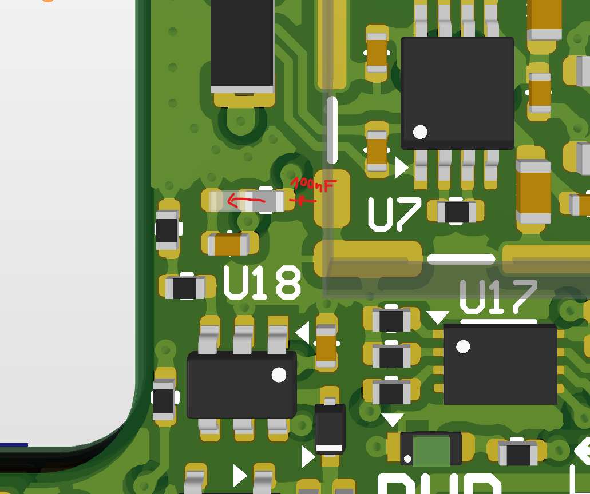
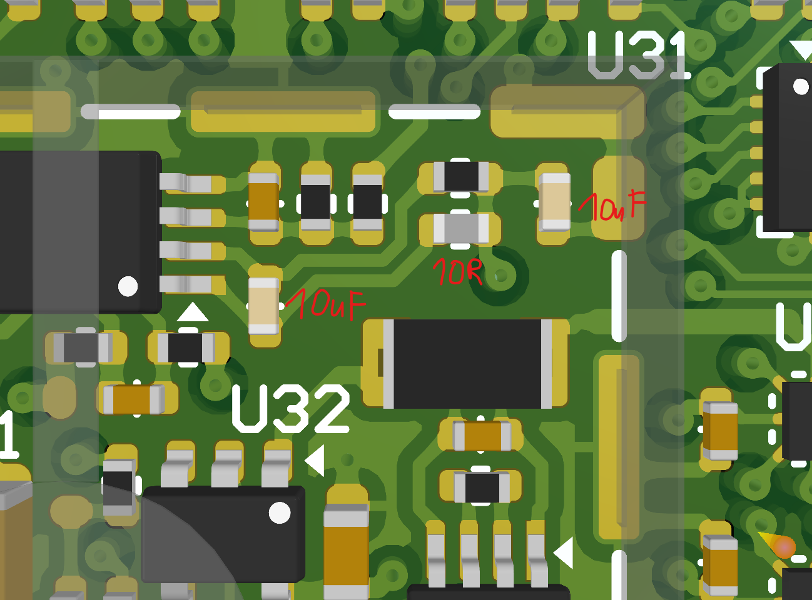
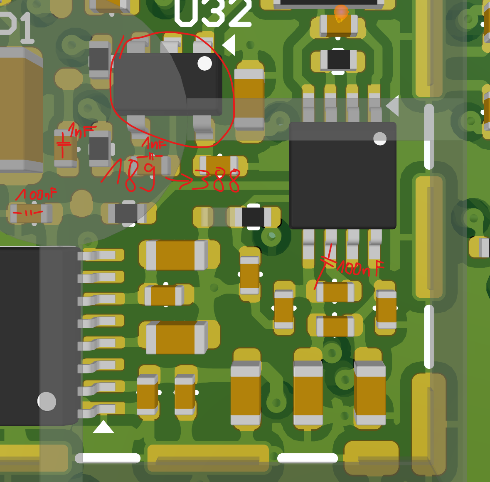

# Cape v2.4b - Performance

## Hardware

- 15 Capes with Emu & Hrv, produced by Egas
- Serialnumbers

    - 1270053 →initial test subject, Update: defect VConverter
    - 1270057 → kai
    - 1270060 → new LabTester

Remaining PCBs became the first testbed-instance at TUD. See [Doc Testbed](https://github.com/orgua/shepherd_v2_planning/tree/main/doc_testbed)

## Manual Soldering

- 2x 2x46 Pinheader ⇾ BBone Port
- 2x 2x9 Pinheader ⇾ Target Ports
- 2Pin Screw-Header ⇾ VoltageInput
- 4Pin Connector on Bottom ⇾ External LED-PushButton
- 2x2 PinHeader ⇾ HrvPort

- Caps on Bottom
    - 6V Rail ⇾ ~~10V 680 uF, DNP
    - L5V Rail ⇾ ~~6V3 1 mF~~, 2x 220 uF 6V3 MLCC
    - 5V Rail ⇾ ~~6V3 1mF~~, DNP, 2x 220 uF 6V3 MLCC
    - 16V Rail ⇾ ~~25V 470 uF~~, 2x 100 uF 16V MLCC

## Manual Fixes

- U32 (SOT23-5) Opa189 ⇾ replace with Opa388
- U3 (Emu-mid-right) ⇾ add >= 100 nF from Pin6 to -6V (Pin5) or left side of cap (in front)
- R-Serial: 14x 470 R to 240 R (put second 470R on-top)
- switch Hrv-Ref to 0R-to-GND (R132) - left bottom outside hrv-cage + add 100nF to GND there for 10mV (now free Pad)
- stabilize 10 mV ⇾ 1uF increase to 2x 10uF, 2R increase to 10R (PIC

## Initial Test for Functionality

### PCB Nr. 1270053

- visual: OK

    - all ICs and diodes correct orientation
    - no visible shorts or other defects

- 5V In: 0mA, OK
- EN-Pin: 105 mA, OK, but 3x higher than before, but with hrv (was 71 mA on hw-v2.1)
- voltages:

    - L5V ⇾ 5.000 V, R_Open (VCC to GND)
    - L3V3 ⇾ 3.295 V, R_open
    - 6V ⇾ 6.19 V,  R_Open
    - 10V ⇾ 9.71 V,  R_Open
    - -6V ⇾ -5.99 V, R_Open
    - 10mV, R_Open
    - 5V, R ~ 220 Ohm

- **for reference**: 1270057 behaves the same
- booting with cape: all OK

    - 340 - 400 mA during boot
    - ~ 330 mA after boot

- devicetest-tool - OK

    - ADCs & DACs work
    - GPIO out is working
    - Changing Power & GPIO routing works

- GPIO Sweep ⇾ safe Bandwidth ~ 3 MHz, 10 MHz might also work
- GPIO Toggling:

    - Port A: works on all Pins
    - Port B: open

- Watchdog: OK
- Cal OK
- Profiling OK

    - but pretty high stddev on ADC-Current for hrv & emu (~80)

Defect - VReg → TLDR: U20/6VReg

- One Short on Voltage Rails
    - 5V ⇾ 10 R to GND on input, 5.5R after L
    - -6V, 10mV, 3V3, L5V, 10V OK
    - Powering Board is OK, BUT EN draws max C at 20mV (short)
- L5 gets warm (32C) ⇾ 10 R
    - D11 (to 6V) also shows 10R / 1k (both dir), and 136 mV V_fw
    - U20 (6VReg) Sw (p1) to GND (Pin2) is <3R but should be >1k (FIRST Defect!!!!)
- Powering individual Rails
    - 6V ⇾ 40mA OK (with EN)
    - L5V ⇾ 28mA ok
    - 10v 28mA
    - FAIL: provided 5V to 3V3 rail
    - 3V ⇾ max C (300mA) down to 2V ⇾ U21 gets really hot > 60C


### PCB Nr. 1270057

- Visual OK
- GPIO Toggling Port A & B all Pins OK
- Emu as expected

- TODO: Cal with & without additional Caps, GPIO-Direction-Change,

### PCB Nr. 1270060

- Initial Tests OK
- High C after Mods (EN)
- No Shorts on voltage Rails
    - 6V direct ⇾ 44mA OK ?
    - 3V3 direct ⇾ 7mA OK
    - 10V with +6 ⇾ 30mA OK
    - -6V
- ⇾ Fixed (with cleaning?)

### PCBs for TB

- 1270051: 92mA On
- 1270052: 94mA On
- 1270053: [105mA], 1st LabPrototype ⇾ burned VReg
- 1270054: 93mA On
- 1270055: 91mA On
- 1270056: 90mA On
- 1270057: 2nd LabPrototype ⇾ Kai
- 1270058: 90mA On
- 1270059: 96mA On
- 1270060: 92mA On, 3rd LabPrototype ⇾ Short?
- 1270061: 96mA On
- 1270062: 96mA On
- 1270063: 99mA On
- 1270064: 92mA On
- 1270065: 90mA On

Calibrate...

```Shell
shepherd-cal calibration measure -v --cape-serial 1270060 --write --smu-ip 10.0.0.24 sheep0
shepherd-cal calibration write -v --cal-file ./2023-08-27_12-39-20_shepherd_cape.cal_data.yaml sheep0
```

profile..

```Shell
shepherd-cal profile measure -v --short --cape-serial 1270060 --smu-ip 10.0.0.24 sheep0
shepherd-cal profile analyze -v --plot ./
```

## Errors & Improvements (for 2.4c)

### BB does not survive turning on the cape

- Reason: Voltage drop due to increased Caps on Rails
- FIX: Order for 5V-Input:
- 3.3 mF Cap: https://www.mouser.de/ProductDetail/Rubycon/6.3ZLJ3300M10X25?qs=T3oQrply3y/OcsI9e27BJQ%3D%3D
- 6.8 mF Cap: https://www.mouser.de/ProductDetail/Panasonic/ECA-0JHG682?qs=R8vM2Es5yU5OqYwkFTor4Q%3D%3D

Solution: reduce size of both 5V Caps on Backside

### Emu

- U32 (SOT23-5) Opa189 does not work for emulator for full range ⇾ replace with Opa388
- ref-voltage can use more buffering ⇾ add >= 100 nF from U3-Pin6 to -6V (Pin5) or left side of cap (in front)

    - ~same for U7~ ⇾ but that Ref-Pin5 changed to GND, so nvm

- EMU: Voltage-dependency for Current Measurement after switching to Opa388

    - 0V: ~ 550 n, 5V: ~ 980 n
    - ⇾ +430 increments for + 5 V change (= +80 uA error, or +8.39 mV @ ADC-Input)
    - there is no current flow! Trace cut after Shunt
    - AD8429 - Ref to Output has only 50 kOhm (older PCB show the same)
    - **tldr**: ref-pin does not work as expected when != GND and shared
        - 2R of Reference (can cause 500 uV offset) ⇾ causes 20 - 50 of the 400+ n offset
        - **only 1 InAmp for the Reference ⇾ fixes the problem**
        - switch Hrv-Ref to 0R-to-GND (R132) - left bottom outside hrv-cage + add 100nF to GND there for 10mV
    - TODO:
        - hrv looked fine, why?
        - try load-R + Cap between Ref & Output of InAmp

- stabilize Emu, Current measurement
- hardwire 10mV only to Emu

Mod1 - Reroute 10mV away from Hrv



Mod2 - Stabilize 10mV



Mod3 - Improve voltage Buffering for EMU



### Gpio

Change resistor-values to match new target-design for allowing improved current limiting


## Profiling

### Ref = GND

```
  DAC @ 0.400 V;        SMU: 0.100 mA @ 0.3998 V;       I_raw: mean=466.85, stddev=99.89
  DAC @ 0.400 V;        SMU: 1.000 mA @ 0.3998 V;       I_raw: mean=4903.37, stddev=85.11
  DAC @ 0.400 V;        SMU: 10.000 mA @ 0.3995 V;      I_raw: mean=49276.55, stddev=88.43
  DAC @ 0.400 V;        SMU: 20.000 mA @ 0.3993 V;      I_raw: mean=98601.06, stddev=101.11

  DAC @ 2.000 V;        SMU: 0.100 mA @ 1.9999 V;       I_raw: mean=465.69, stddev=82.45
  DAC @ 2.000 V;        SMU: 1.000 mA @ 1.9999 V;       I_raw: mean=4902.77, stddev=70.92
  DAC @ 2.000 V;        SMU: 10.000 mA @ 1.9996 V;      I_raw: mean=49274.69, stddev=75.39
  DAC @ 2.000 V;        SMU: 20.000 mA @ 1.9993 V;      I_raw: mean=98596.15, stddev=86.44

  DAC @ 5.000 V;        SMU: 0.100 mA @ 4.9828 V;       I_raw: mean=463.06, stddev=5.78
  DAC @ 5.000 V;        SMU: 1.000 mA @ 4.9732 V;       I_raw: mean=4900.14, stddev=5.81
  DAC @ 5.000 V;        SMU: 10.000 mA @ 4.8746 V;      I_raw: mean=49275.76, stddev=7.61
  DAC @ 5.000 V;        SMU: 20.000 mA @ 4.7552 V;      I_raw: mean=98601.86, stddev=12.64
```

### Ref = 10 mV

```
  DAC @ 0.400 V;        SMU: 0.100 mA @ 0.3998 V;       I_raw: mean=1023.15, stddev=99.29
  DAC @ 0.400 V;        SMU: 1.000 mA @ 0.3998 V;       I_raw: mean=5464.52, stddev=85.00
  DAC @ 0.400 V;        SMU: 10.000 mA @ 0.3996 V;      I_raw: mean=49884.01, stddev=88.74
  DAC @ 0.400 V;        SMU: 20.000 mA @ 0.3993 V;      I_raw: mean=99258.19, stddev=101.85

  DAC @ 2.000 V;        SMU: 0.100 mA @ 1.9999 V;       I_raw: mean=1182.66, stddev=83.35
  DAC @ 2.000 V;        SMU: 1.000 mA @ 1.9999 V;       I_raw: mean=5623.73, stddev=73.04
  DAC @ 2.000 V;        SMU: 10.000 mA @ 1.9997 V;      I_raw: mean=50041.69, stddev=76.88
  DAC @ 2.000 V;        SMU: 20.000 mA @ 1.9995 V;      I_raw: mean=99412.23, stddev=87.57

  DAC @ 5.000 V;        SMU: 0.100 mA @ 4.9827 V;       I_raw: mean=1458.09, stddev=6.08
  DAC @ 5.000 V;        SMU: 1.000 mA @ 4.9732 V;       I_raw: mean=5899.41, stddev=6.18
  DAC @ 5.000 V;        SMU: 10.000 mA @ 4.8756 V;      I_raw: mean=50311.76, stddev=7.57
  DAC @ 5.000 V;        SMU: 20.000 mA @ 4.7576 V;      I_raw: mean=99679.24, stddev=12.69
```

### Ref = 10 mV, double 0R

```
  DAC @ 0.400 V;        SMU: 0.100 mA @ 0.3998 V;       I_raw: mean=1335.36, stddev=99.78
  DAC @ 0.400 V;        SMU: 1.000 mA @ 0.3998 V;       I_raw: mean=5776.61, stddev=85.28
  DAC @ 0.400 V;        SMU: 10.000 mA @ 0.3996 V;      I_raw: mean=50194.40, stddev=88.54
  DAC @ 0.400 V;        SMU: 20.000 mA @ 0.3993 V;      I_raw: mean=99565.63, stddev=101.33

  DAC @ 2.000 V;        SMU: 0.100 mA @ 1.9999 V;       I_raw: mean=1494.28, stddev=82.19
  DAC @ 2.000 V;        SMU: 1.000 mA @ 1.9999 V;       I_raw: mean=5935.56, stddev=71.70
  DAC @ 2.000 V;        SMU: 10.000 mA @ 1.9997 V;      I_raw: mean=50351.44, stddev=75.40
  DAC @ 2.000 V;        SMU: 20.000 mA @ 1.9994 V;      I_raw: mean=99723.23, stddev=86.35

  DAC @ 5.000 V;        SMU: 0.100 mA @ 4.9827 V;       I_raw: mean=1771.01, stddev=6.09
  DAC @ 5.000 V;        SMU: 1.000 mA @ 4.9732 V;       I_raw: mean=6212.20, stddev=6.03
  DAC @ 5.000 V;        SMU: 10.000 mA @ 4.8753 V;      I_raw: mean=50624.02, stddev=7.78
  DAC @ 5.000 V;        SMU: 20.000 mA @ 4.7568 V;      I_raw: mean=99989.86, stddev=12.78
```

```
adc_voltage = value_raw * 1.25 * 4.096 / (2**18)
            = 8.39 mV observed offset-error
```

## Bughunt with AD8421 Datasheet

RREF: 2;
GAIN: 2 * (10e3 + RREF) / (20e3 + RREF);
Error: 5*GAIN - 5;
⇾ ~ 500 uV
