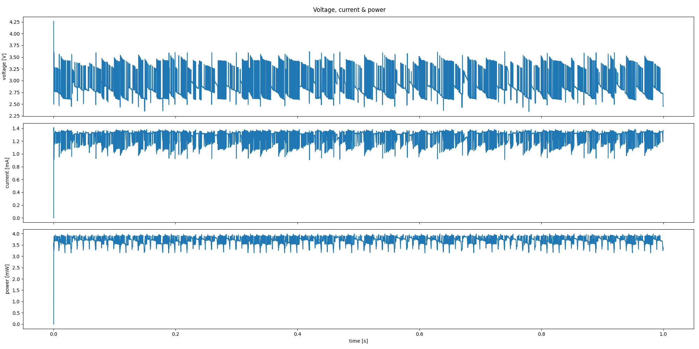
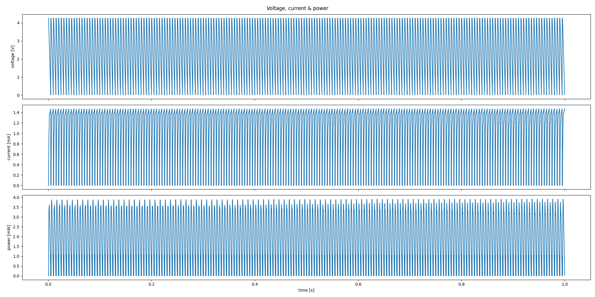

# Harvester Frontend Validation

Test of various harvesting algorithms with a solar cell

- solar cell: IXYS SM101K09L
- lighting by philips LED 5.9 W 806 lm 2000-2700 K, 50 Hz
- lamp was ~ 10 cm above solar cell & the setup was covered with a white lampshade
- [harvesting Profiles in detail](https://github.com/orgua/shepherd-datalib/blob/main/shepherd_core/shepherd_core/data_models/content/virtual_harvester_fixture.yaml)

Algorithms used:

- `mppt_opt`: very fast MPPT based on perturb & observe algorithm (Steps: 1 mV, 10 us)
- `mppt_bq`: MPPT of TI BQ-Converters for solar
- `cv20`: constant voltage of 2.0 V
- `ivcurve`: postponed harvesting by sampling ivcurves (voltage stepped as sawtooth-wave)

Commands used:

```shell
shepherd-data extract-meta hrv.h5
shepherd-data plot hrv.h5 -e 10
shepherd-data plot hrv.h5 -e 1
shepherd-data plot hrv.h5 -e .1
```

## Harvested Energy

Values are calculated for a 10 s trace.

- `mppt_opt`: 36.720 mWs
- `mppt_bq`: 35.957 mWs
- `cv20`: 26.371 mWs
- `ivcurve`: 19.718 mWs

## Plots

### OPT

The algorithm produces higher noise than the others due to the perturb-part to find a better set-point.



In more detail:


### BQ

BQ-Converters sample the open circuit voltage (VOC) every 16 s for about 256 ms and harvest at a set-point of 0.76 * VOC. First the voltage, then the current shows typical 50 Hz line flicker from the fast LEDs.


In more detail:


### CV20

Due to the constant voltage the 50 Hz line flicker is only visible in the current-plot.


In more detail:


### IVCURVE



In more detail:


Due to the 50 Hz line flicker every current ramp is uniquely shaped.
