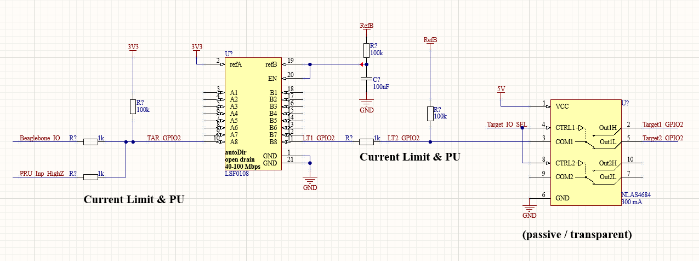
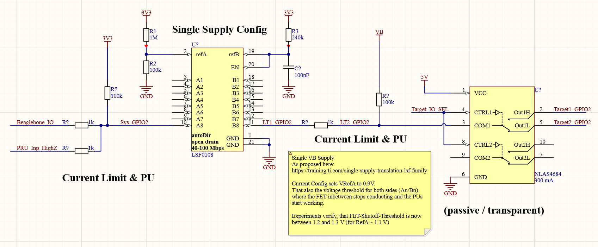

# LSFxyz GPIO Level Translators

## Problem

- cape versions: v2.0 to v2.2 (and higher?)
- voltages on B-side seemed to work fine from 2.5 V to 5V, but showed errors below,
- Nexperia LSF0108 seems to have hidden properties that are not mentioned in the datasheet
- expected behaviour
    - open drain on both sides when pins float / only PUs active
    - PUs bring pins to ref-voltage
    - a low on side results in a low on the opposite side

## Setup

- Side A has constant supply voltage of 3.3 V
- side B supply is dynamic, 0 to 5 V, but voltages below 1 V are not expected to be covered by the translator



## Nexperia LSF0108

- marketed as bidirectional, multivoltage, open-drain, push-pull
- translation between "0.95 V and 1.8, 2.5, 3.3 and 5V" (room for speculation)
- unlike the TI-Versions, this IC does not have voltage constraints (like V_A has to be >= 0.8 V + V_B)
- "An and Bn pins may be exchanged" (mentioned more than once)

## Measurements

- Low to high
    - V_RefA = 3v3, V_RefB = 4v5
    - both sides highZ, only PUs working -> V_A and V_B settle at 1.2 V -> UNEXPECTED, should be VRef
    - Side A tied to GND -> V_B = 0 V
    - Side A tied to 3v3 -> V_B = 3v3 -> UNEXPECTED, V_B is capped at 3v3
    - Side B tied to GND -> V_A = 0
    - Side B tied to 4V5 -> V_A = 3 V
- High to Low
    - V_RefA = 3v3, V_RefB = 2v0
    - both sides highZ, only PUs working -> V_A and V_B settle at 0.9 V -> UNEXPECTED, should be VRef
    - Side A tied to GND -> V_B = 0 V
    - Side A tied to 2v0 -> V_B = 1v9 -> UNEXPECTED, but ok
    - Side A tied to 3v3 -> V_B = 2v0
    - Side B tied to GND -> V_A = 0 V
    - Side B tied to 2V0 -> V_A = 1.4 V -> UNEXPECTED, still below detection threshold

## Fixing the LSF

- most answers are implied by: https://training.ti.com/multi-voltage-translation-lsf-family
- Bias Voltage
    - V_B (B for Bias?) needs 200 kOhm PU and V_B > V_A + 0.8 (TI-Rules don't hurt)
    - current will flow from B to A, limited by the 200 kOhm
    - voltage between RefA-to-B will be threshold voltage of FETs (V_B = V_Bias = V_A + V_thres)
    - video 8 in the series even shows a single VB supply schematic with a voltage divider on A-Side -> see below
- V_A should be the lowest voltage in System, so V_A gets 1V from an additional supply
- PUs
    - PUs are possible on neither, one, both sides
    - not needed on sides that only drive (push-pull)
    - not needed on receiving low side with input leakage lower 1 uA
    - needed when level is not on corresponding level V_A or driver is only open drain
- both Ref-Voltages are independent of real voltages used on each side
- PUs on target side should not be driven by current-sensed line

**Single Supply Calculation (Maxima)**

```
# available parts, R1/R2 are part of a voltage divider on RefA-Side, R1 is the high side, R3 is current limiter of RefB:
R1: 1e6;
R2: 100e3;
R3: 240e3;
# VFet-Nexperia is 1 V, TI is 0.85 V (referring to datasheet), nexperia shows ~ 575 mV voltage drop
VFet: 0.575;
VB: 3.3;

R2 = R3 * R1 * VRefA / ((R3 + R1)*(VB - VRefA) - VFet * R1);
solve(R2, VRefA);

VRefAA: ((R2*R3 + R1*R2) * VB - R1 * R2 * VFet) / (R1*R2 + R1*R3 + R2*R3);
# VRefA = 0.89 V for TI, 0.85 V for Nexperia
```



## Single Supply Verification

- schematic above was recreated
- Ref A settles at 1.079 V, Ref B at 1.673 V -> fet-diode seems to drop ~ 600 mV
- as soon as one side is above ~ 1.2 V (only tested 0.1 V steps), the other voltage is controlled by PU on that side
- Source-Meter on B-Side shows about 1 MOhm for High Signal (with PU of same voltage) down to ~ 1.2 V (< 0.4 uA)
- below threshold voltage
    - below 1.2 V the source meter controls the voltage on both channels (Pulldown)
    - from -8.3 uA at 1.1 V the sink-current grows to -45 uA at 0.0V (almost linear)
    - Side-A PU is 100k to 3.3 V  and Side-B PU is 100k to 1.3 V, results in
        - 33 + 13 uA to GND -> matches closely with source-meter reading
        - 22 + 2 uA to 1.1 V -> seems to flow into largely in B-Side-PU, because SM-Reading is lower
- without B-Side-PU
    - on B-Side the source meter supplied the following currents into B-Side
    - 1.5 uA @ 1.2 V (800 kOhm)
    - 5.3 uA @ 1.5 V (283 kOhm)
    - 9.2 uA @ 2.0 V (217 kOhm)
    - 13 uA @ 2.5 V (192 kOhm)
    - 17 uA @ 3.0 V (176 kOhm)
    - 21 uA @ 3.5 V (167 kOhm)
    - 25 uA @ 4.0 V (160 kOhm)
    - 29 uA @ 4.5 V (155 kOhm)
    - 32 uA @ 5.0 V (156 kOhm)


## Inner Workings

- CMOS Driver (Push-Pull) on one side, CMOS Receiver (High-Z) on other side, with PU on each side
- Driver LOW -> current will sink into transmitter, current is generated by both PUs, FET / Translator will generate a small voltage drop
- Driver HIGH -> FET / Translator will turn off (cut line) reaching VA, transmit-line is controlled by driver, receiver side by PU from then on

	
## Alternatives

- constraints: BiDir, Auto-sensing, one side 3v3, other side 1.7 - 5 V (nRF52)
    - TXB -> needs relativly high driving current
    - TXS -> has internal PU, but relies on VRef-Relation
    - LSF -> only conducts on lowside, needs external PU
    - ICs from TI seem to always need special VRef-Relation
    - Nexperia ICs are new and on order (but offer better specs)
- special uniDir solutions
    - spi, sn74lv4t125, spi, https://www.ti.com/product/SN74LV4T125#product-details##features
    - 1bit unidir, sn74lv1t34, https://www.ti.com/product/SN74LV1T34#product-details##features
- voltage constraints could be solved by a two-stage approach 3v3 <-> 0v9 <-> 1.x - 5V
- BiDir with Dir-Pin
	- https://www.ti.com/lit/ds/symlink/sn74lvc2t45.pdf?ts=1625563250176&ref_url=https%253A%252F%252Fwww.ti.com%252Fproduct%252FSN74LVC2T45

## TODO

- previous: post-shunt-voltage was fed to level translators (PUs showed up in current-draw of target)
- currently pre-shunt-voltage is fed to level-translators
- cleaner solution
    - buffer post-shunt-voltage, saves one switch, but costs additional OPAs
