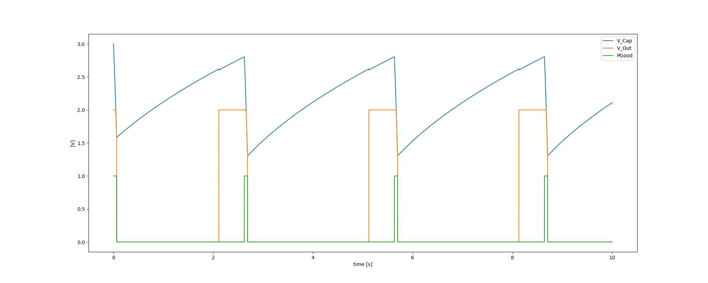
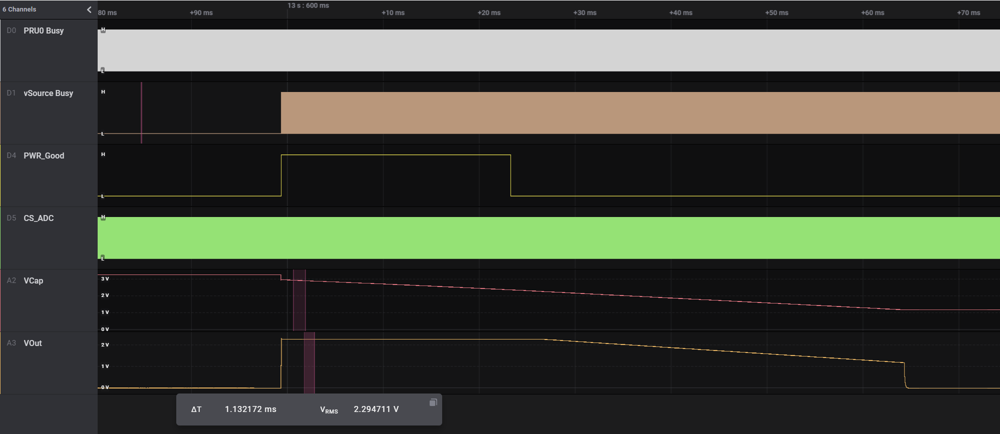
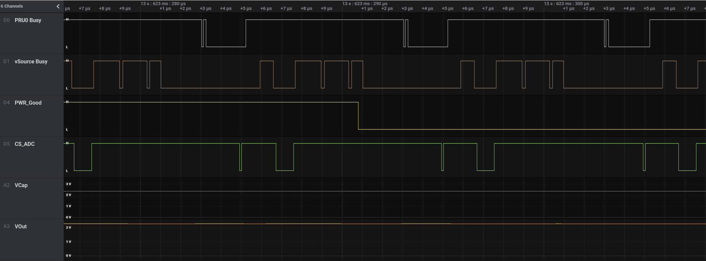

# Virtual Source

## Current Features

- general features
    - fully customizable per yaml-parameter-set
    - or choose one of the predefined sets by name ie. "virtsource: BQ25504s" for the BQ-Regulator with pwr-good-schmitt-trigger
    - inherit from existing parameter-sets with ie. "converter-base: neutral" (neutral is default inheritance) -> only altered parameters needed in new set
    - emulator can either record output or intermediate node (storage cap)
- Input
    - oneway, imagine a perfect diode at the start so no current can flow back
    - diode voltage-drop can be configured from 0 to x Volt
    - maxima for input voltage and current (power limit)
- Boost-converter, optional, with
    - enable minimum threshold voltage for input
    - disable maximum threshold for boost-output (intermediate voltage)
    - efficiency factor with 2D-LUT (12x12), depending on input voltage & current
        - thresholds are configurable in 2^n steps
        - voltage divisions are linear, depending on lowest threshold
        - current-divisions are log2, also depending on lowest threshold
        - example: voltage threshold n=7 is setting first array boundary to 2^7 = 128 uV, so lut[0] is for V < 128 uV, lut[1] is for 128 to 256 uV
- capacitor, optional, with
    - capacitance from 1 nF to 1 F
    - initial voltage
    - leakage current
    - switchable output, hysteresis with checks at defined intervals
    - power-good-signal with hysteresis either in intervals or immediate (schmitt-trigger)
- buck converter, optional, with
    - fixed output voltage
    - ldo-drop-voltage, alternatively working like a diode when buck is off or intermediate voltage is below output-voltage + drop-voltage
    - efficiency factor with 1D-LUT, depending on output-current
        - threshold is configurable in 2^n-steps
        - current-divisions are log2, depending on lowest threshold
        - example: current threshold n=5 is setting first array boundary to 2^5 = 32 nA, so lut[0] is for I < 32 nA, lut[1] is for [32, 64] nA, lut[2] is for [64, 128] nA
- switchable output
    - simulated external Capacitor - should be set to buffer size of target: fast transients can't be fully monitored by shepherd




## Implementation

- fixed point math with u32 & u64 with voltages in uV, currents in nA, power in fW, capacity in nF
- a python port is available
- modules
    - InputPower - calculated from recorded C-V-traces
    - OutputPower - voltage is set by DAC, current is measured by ADC
    - CapacitorUpdate - Voltage delta is calculated by resulting sum of Power
    - regulatorUpdate - handles internal States and Output
- limits
    - input power can be 56 bit in size (fW = uV * nA) -> ~ 72 W
        - lowest value for algorithm is 64 fW, but due to ADC limitations 195 nA * 19 uV = 3.7 pW
    - output power can be 50 bit in size (fW = uV * nA) -> ~ 1 W
        - difference to input due to inverted efficiency taking 14 instead of 8 bit
    - capacitor voltage can be 4.2 kV
        - due to custom faster division-function the range with low error is 0 to 5 V
        - optimization in calc_out_power limits voltage to 2^28 uV = 268 V, lower bound is 64 uV
    - storage capacitor can not be larger than 2.68 F (= 10*(2^28) nF), reasonable boundaries are [1 nF, 100 mF]
    -
- Speed in PRU (max timings)
    -   280 ns calc input power
    -  3200 ns calc output power
    - 10500 ns update capacitor
    -   470 ns update boost-buck
    - ~14000 ns for all (with space in between)
- Optimizing Algorithm for Speed
    - a custom uDiv() brings "update cap" down to 7500 ns, whole iteration takes 11684 ns
    - leaving out I_leakage is significantly faster (calc output is done in 310 ns instead of 3200, similar to input) but resulting output-power is wrong
        - seems to be undefined behaviour introduced by implicit typecasting
        - -> undefined it is! see documentation below
    - new ruleset:
        - u64 add, sub, shift are fine and fast!
        - u64 mul should be avoided, duration is depending on size of number (3000 - 4800 - 6400 ns for 4, 16, 32 bit)
        - u32 * u32 can give u64 result when both or last factor are typecasted - it is still fast! -> uint64_t result = (uint64_t)num32a * (uint64_t)num32b;
- using the ruleset brings:
    -  280 ns calc input power
    -  430 ns calc output power
    - 5400 ns update capacitor
    -  540 ns update boost-buck
    - resulting time is around 6900 - 7060 ns
- using a custom mul64()-function
    -  280 ns calc input power
    -  500 ns calc output power
    -  950 ns update capacitor
    -  540 ns update boost-buck
    - resulting in < 2600 ns for all
- adding boundary checks for math-ops
    -  700 ns calc input power
    - 1350 ns calc output power
    - 1300 ns update capacitor
    -  580 ns update boost-buck
    - resulting in < 4300 ns for all
- TODO: benchmark new extended code

## How PRU0 Spends the 10 us per Cycle

- ~ 1 - 2 us busy waiting for trigger (headroom for more workload)
- 100 ns trigger ADC-Reading
- 200 ns getting to Sampling Routine
- 650 ns load remote buffer-values (input IV)
- 700 ns calculate input power
- 1100 ns read ADC, output current
- 1300 ns calculate output power
- 1300 ns update capacitor
- 580 ns update boost-buck
- 2000 ns write DAC (currently both channels are written for debug) and buffer-output
- 200 ns message handling





## Performance on real hardware

- dataset: indoor_solar/sheep4/office_sd.h5
- cap 22 uF, 50% eta_in, 80% eta_out
- sim-sets
    - 10 mA drain shows dutycycle of ~ 0.27 %, On-Time is ~ 800us
    - 1 mA drain, dutycycle ~ 2.7 %, On-Time ~ 8.16 ms.
- cap voltage moves between power-good-thresholds of 2.4 and 2.8 V


## Dev Scratch Area

TI Compiler behaviour

```C
// u64 * u64 -> 7 us
// u32 * u64 -> 2.56 us
// u64 * u32 -> 0.03 us, es rechnet nur u32*u32

uint64_t debug_math_fns(const uint32_t factor, const uint32_t mode)
{
    const uint64_t f2 = factor + ((uint64_t)(factor) << 32);
    const uint64_t f3 = factor - 10;
    GPIO_TOGGLE(DEBUG_PIN1_MASK);
    uint64_t result = 0;
    if (mode == 1)
    {
        const uint32_t r32 = factor * factor;
        result = r32;
    }									// ~ 28 ns, limits 0..65535
    else if (mode == 2)	result = factor * factor; 			// ~ 34 ns, limits 0..65535
    else if (mode == 3)	result = (uint64_t)factor * factor; 		// ~ 42 ns, limits 0..65535 -> wrong behaviour!!!
    else if (mode == 4)	result = factor * (uint64_t)factor; 		// ~ 48 ns, limits 0..(2^32-1) -> works fine?
    else if (mode == 5)	result = (uint64_t)factor * (uint64_t)factor; 	// ~ 54 ns, limits 0..(2^32-1)
    else if (mode == 5)	result = ((uint64_t)factor)*((uint64_t)factor); // ~ 54 ns, limits 0..(2^32-1)
    else if (mode == 11)	result = factor * f2;				// ~ 3000 - 4800 - 6400 ns, limits 0..(2^32-1) -> time depends on size (4, 16, 32 bit)
    else if (mode == 12)	result = f2 * factor;				// same as above
    else if (mode == 13)	result = f2*f2;					// same as above
    else if (mode == 21)	result = factor + f2;				// ~ 84 ns, limits 0..(2^31-1) or (2^63-1)
    else if (mode == 22)	result = f2 + factor;				// ~ 90 ns, limits 0..(2^31-1) or (2^63-1)
    else if (mode == 23)	result = f2 + f3;				// ~ 92 ns, limits 0..(2^31-1) or (2^63-1)
    else if (mode == 24)	result = f2 + 1111ull;				// ~ 102 ns, overflow at 2^32
    else if (mode == 25)	result = 1111ull + f2;				// ~ 110 ns, overflow at 2^32
    else if (mode == 26)	result = f2 + (uint64_t)1111u;			//
    else if (mode == 31)	result = factor - f3;				// ~ 100 ns, limits 0..(2^32-1)
    else if (mode == 32)	result = f2 - factor;				// ~ 104 ns, limits 0..(2^64-1)
    else if (mode == 33)	result = f2 - f3;				// same
    else if (mode == 41)	result = ((uint64_t)(factor) << 32u);		// ~ 128 ns, limit (2^32-1)
    else if (mode == 42)	result = (f2 >> 32u);				// ~ 128 ns, also works
    GPIO_TOGGLE(DEBUG_PIN1_MASK);
    return result;
}
```

## BQ25504 - Datasheet RevE

- Input MAX: 0.1 A, 3 V, 300 mW
- Input MIN: Cold Start Voltage 0.6 V, Harvesting down to 130 mV, Datasheet speaks of 10uW min Charging
- Quiescent Current Iq_vstor < 330 nA for UV Condition, 570 nA in OV
- Battery Charge Voltage 2.5 - 5.25 V
- VBAT_OK-Signal
- Caps
	- Input 4.23 - 5.17 uF
	- Storage 4.23 - 5.17 uF
	- Battery 100 uF and more
- VBatOV 2.5 - 5.25 V
- VBatUV 2.2 - VBatOV
- Input Efficiency (Page 9)
	- 10 uA: 0 % for 130 mV, 90 % for 3 V
	- 100 uA: 10 % for 130 mV, 90 % for 3 V
	- 10 mA: 40 % for 130 mV, 93 % for 3 V
	- model needs better definition of limits
- TODO: continue on p. 11, https://www.ti.com/lit/ds/symlink/bq25504.pdf?ts=1625558784652&ref_url=https%253A%252F%252Fwww.ti.com%252Fproduct%252FBQ25504%253Futm_source%253Dgoogle%2526utm_medium%253Dcpc%2526utm_campaign%253Dapp-null-null-GPN_EN-cpc-pf-google-eu%2526utm_content%253DBQ25504%2526ds_k%253DBQ25504%2526DCM%253Dyes%2526gclid%253DEAIaIQobChMI_6nZmf7N8QIVmrd3Ch3Q4AxNEAAYASAAEgKpwPD_BwE%2526gclsrc%253Daw.ds

### Implemented

- pru - check overflow with custom mul(), add(), sub() and limit to max / min
- add min to limits in python
- change efficiency to native 0 - 1 num
- extend converter: pre-power: voltage, duration
- extend converter: i-inp-max, v-inp-max,
- check and warn about limits in Python
- add BQ25504

### HowTo fill Efficiency LUTs:

- find lowest threshold for current and voltage
- it helps to add current/voltage-values for each column/row as comment on the outside
- additional help: use editor that can highlight a string and fill table with placeholders (1.00 or 0.00 should work)
- efficiency-graphs in datasheet allowed to deduct values and fill single columns and rows of 12x12-Table
- the bq25504-input LUT had less than 30 (of 144) undetermined values -> interpolation with not much guesswork

## BQ25570

- implemented / defined and tested
