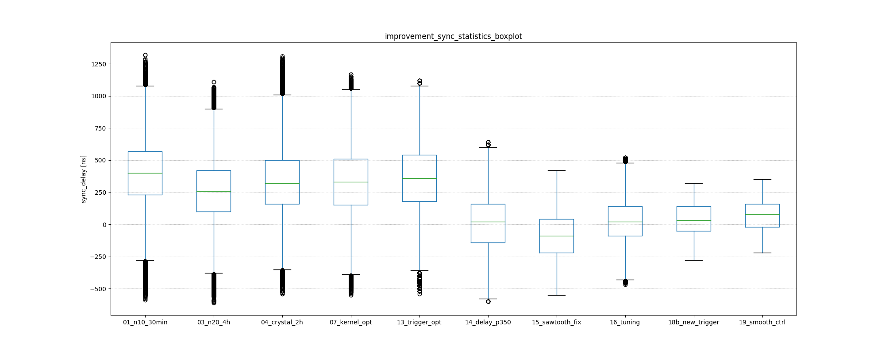
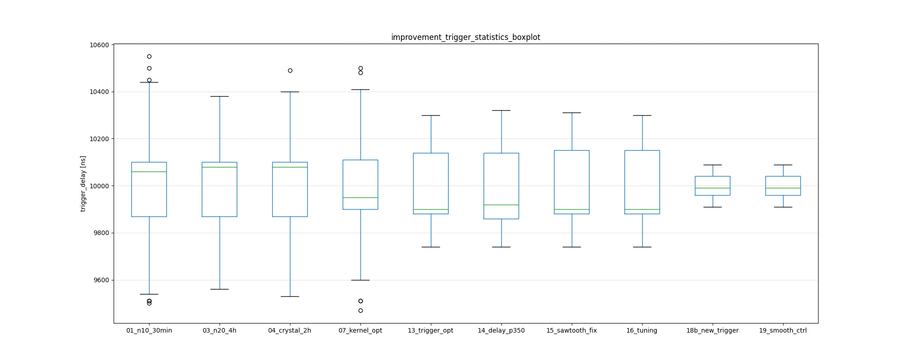

# Time-sync on GPIO-Level

Problem

- ptp4l runs, but two sheep don't seem to be in sync when comparing ADC-CS-Trigger-Edges
- spoiler: it was a slow switch and untuned ptp

Setup

- two beaglebones are connected via ethernet to same switch
    - one beaglebone is default dev-environment, the other is freshly installed
    - both have shepherd-code from https://github.com/orgua/shepherd installed
    - both beaglebones were restarted more than once and had plenty of time to sync
- switch
    - fritzbox, up to date and even restarted
    - later an additional Cisco Catalyst 2960-S was added to same network

Mechanism

- two services (ptp4l, phc2sys) are keeping time between Beaglebones, with hardwaretimestamping
- shepherd-kernel-module and pru-code are syncing the low level hardware-timer that triggers the sampling

Running services

```Shell
/usr/sbin/ptp4l -f /etc/linuxptp/ptp4l.conf -i eth0
/usr/sbin/phc2sys -q -m -a -rr

# better:
sudo systemctl restart phc2sys@eth0
```

Configs are copied from shepherd/deploy/[...] to

```
/etc/systemd/system/phc2sys.service.d/phc2sys_mands.conf
/etc/systemd/system/ptp4l.service.d/ptp_restart.conf
```


Get log-data from sync

```Shell
sudo find / -name ptp*
# ⇾ shows no log-files

sudo pmc -u -b 0  'GET CURRENT_DATA_SET'
# ⇾ offsetFromMaster is jumping like crazy
sudo pmc -u -b 0  'GET TIME_STATUS_NP'

sudo pmc -u -b 0  'GET PORT_DATA_SET'
# ⇾ one sheep should show "master", the others "client"

sudo journalctl -f -u phc2sys@eth0
# ⇾ not so helpful

sudo journalctl -f -u ptp4l@eth0
# ⇾ most helpful feedback

# for the herd:
shepherd-herd -vvv shell-cmd -s 'journalctl -n 10 -u ptp4l@eth0'
shepherd-herd -vvv shell-cmd -s 'journalctl -n 10 -u phc2sys@eth0'
```

Sync-Log from the Fritzbox

```Shell
sudo journalctl -f -u ptp4l@eth0

    Feb 15 20:04:04 sheep1 ptp4l[383]: [24.634] master offset     -10931 s2 freq  +16451 path delay    154478
    Feb 15 20:04:05 sheep1 ptp4l[383]: [25.634] master offset      47850 s2 freq  +71953 path delay    126215
    Feb 15 20:04:06 sheep1 ptp4l[383]: [26.634] master offset      36291 s2 freq  +74749 path delay    123934
    Feb 15 20:04:07 sheep1 ptp4l[383]: [27.635] master offset      30227 s2 freq  +79572 path delay    123306
    Feb 15 20:04:08 sheep1 ptp4l[383]: [28.635] master offset      11076 s2 freq  +69489 path delay    123306
    Feb 15 20:04:09 sheep1 ptp4l[383]: [29.635] master offset       5765 s2 freq  +67501 path delay    121767
    Feb 15 20:04:10 sheep1 ptp4l[383]: [30.635] master offset      71556 s2 freq +135021 path delay    121470
    Feb 15 20:04:11 sheep1 ptp4l[383]: [31.635] master offset     -73210 s2 freq  +11722 path delay    121470
    Feb 15 20:04:12 sheep1 ptp4l[383]: [32.635] master offset     -31401 s2 freq  +31568 path delay    121470
    Feb 15 20:04:13 sheep1 ptp4l[383]: [33.636] master offset        729 s2 freq  +54278 path delay    121058
    Feb 15 20:04:14 sheep1 ptp4l[383]: [34.636] master offset       8046 s2 freq  +61813 path delay    121058
    Feb 15 20:04:15 sheep1 ptp4l[383]: [35.636] master offset       5453 s2 freq  +61634 path delay    121058
    Feb 15 20:04:16 sheep1 ptp4l[383]: [36.636] master offset       4931 s2 freq  +62748 path delay    121497
    Feb 15 20:04:17 sheep1 ptp4l[383]: [37.637] master offset      -4661 s2 freq  +54635 path delay    121058
    Feb 15 20:04:18 sheep1 ptp4l[383]: [38.637] master offset      21602 s2 freq  +79500 path delay    120077
    Feb 15 20:04:19 sheep1 ptp4l[383]: [39.637] master offset     -11891 s2 freq  +52488 path delay    120516
    Feb 15 20:04:20 sheep1 ptp4l[383]: [40.637] master offset      -5135 s2 freq  +55676 path delay    120240
    Feb 15 20:04:21 sheep1 ptp4l[383]: [41.637] master offset        698 s2 freq  +59969 path delay    120240
    Feb 15 20:04:22 sheep1 ptp4l[383]: [42.637] master offset      -2303 s2 freq  +57177 path delay    120240
    Feb 15 20:04:23 sheep1 ptp4l[383]: [43.638] master offset      -2912 s2 freq  +55877 path delay    120240
    Feb 15 20:04:24 sheep1 ptp4l[383]: [44.638] master offset       1933 s2 freq  +59849 path delay    120240
    Feb 15 20:04:25 sheep1 ptp4l[383]: [45.638] master offset      -1803 s2 freq  +56693 path delay    119055
    Feb 15 20:04:26 sheep1 ptp4l[383]: [46.638] master offset       2346 s2 freq  +60301 path delay    118326
    Feb 15 20:04:27 sheep1 ptp4l[383]: [47.638] master offset       -554 s2 freq  +58105 path delay    119086
    Feb 15 20:04:28 sheep1 ptp4l[383]: [48.638] master offset       -269 s2 freq  +58223 path delay    118872
```

Good Network Switch (Cisco Catalyst 2960-S in same network)::

```Shell
sudo journalctl -f -u ptp4l@eth0

    Feb 15 20:52:42 sheep1 ptp4l[383]: [2942.858] master offset        173 s2 freq  +57987 path delay     12467
    Feb 15 20:52:43 sheep1 ptp4l[383]: [2943.859] master offset        -82 s2 freq  +57784 path delay     12467
    Feb 15 20:52:44 sheep1 ptp4l[383]: [2944.859] master offset        118 s2 freq  +57959 path delay     12454
    Feb 15 20:52:45 sheep1 ptp4l[383]: [2945.859] master offset        -41 s2 freq  +57836 path delay     12454
    Feb 15 20:52:46 sheep1 ptp4l[383]: [2946.860] master offset       -172 s2 freq  +57692 path delay     12463
    Feb 15 20:52:47 sheep1 ptp4l[383]: [2947.860] master offset        -69 s2 freq  +57744 path delay     12434
    Feb 15 20:52:48 sheep1 ptp4l[383]: [2948.860] master offset         64 s2 freq  +57856 path delay     12427
    Feb 15 20:52:49 sheep1 ptp4l[383]: [2949.861] master offset         98 s2 freq  +57909 path delay     12427
    Feb 15 20:52:50 sheep1 ptp4l[383]: [2950.861] master offset       -107 s2 freq  +57734 path delay     12427
    Feb 15 20:52:51 sheep1 ptp4l[383]: [2951.861] master offset        -41 s2 freq  +57767 path delay     12427
    Feb 15 20:52:52 sheep1 ptp4l[383]: [2952.862] master offset         44 s2 freq  +57840 path delay     12436
    Feb 15 20:52:53 sheep1 ptp4l[383]: [2953.862] master offset         36 s2 freq  +57845 path delay     12436
    Feb 15 20:52:54 sheep1 ptp4l[383]: [2954.862] master offset       -129 s2 freq  +57691 path delay     12452
    Feb 15 20:52:55 sheep1 ptp4l[383]: [2955.863] master offset         36 s2 freq  +57817 path delay     12457
    Feb 15 20:52:56 sheep1 ptp4l[383]: [2956.863] master offset        -92 s2 freq  +57700 path delay     12457
    Feb 15 20:52:57 sheep1 ptp4l[383]: [2957.863] master offset        -29 s2 freq  +57736 path delay     12460
    Feb 15 20:52:58 sheep1 ptp4l[383]: [2958.864] master offset         -9 s2 freq  +57747 path delay     12460
    Feb 15 20:52:59 sheep1 ptp4l[383]: [2959.864] master offset         49 s2 freq  +57802 path delay     12461
    Feb 15 20:53:00 sheep1 ptp4l[383]: [2960.864] master offset         44 s2 freq  +57812 path delay     12466
```

Signs of a bad network switch

- path delay on fritzbox was 10x as high as the cisco-switch and the values show variance of 126 to 118 us
    - the cisco switch is very consistent in its path delay, down to 30 ns jitter
- master-offset is jumping, logs even show 70 us offsets
    - the cisco switch is after 30 mins down to <200 ns corrections

On PRU Level

- sync in kernel-module and pru-code works and keeps correcting
- oszi shows that client is mostly behind (mean is ~ 500ns, max seems to be 1 us)
    - quickshot 105-108
- visuals of logic analyzer traces are in ./timesync-folder

```
FILE: sync_2BB_13_trigger_opt
        [  min <|  q05% ||  mean   ||  q95% |>  max  ]
dt_ns 	[ -540 <| -100  || 356.83  || 760   |> 1120  ]
Ch0_ns 	[ 9740 <| 9840  || 10000.4 || 10180 |> 10300 ]
Ch1_ns 	[ 9740 <| 9780  || 10000.4 || 10100 |> 10340 ]
```

PRU-Code

- a method was added that distributes the correction steps equally over remaining sample-triggers
- sampling was strictly aligned to 0
- old intc-code was disabled / removed
- latest improvements made sync_state useless ⇾ intc-routine just sends out timer-count right away
    - no need to wait for timer wrap before sending out msg
- the previous compensation attempts all produced a sawtooth ⇾ fixed


Kernel-Module

- bit-shift with int found (seemed to be harmless, because correction is mostly positive)
- expensive PRU-Sync-Code ported to Kernel (frees pru1 a lot)
- slowed down PI-Controller, +-20 ticks jitter, there is now only +-3
- sync-routine aimed intc for time_comparing right on timer_wrap (50% chance that pru takes a worthless counter-reading after wrap)
    - now 100 us before, enough time get proper counter-value

Debug Output Kernel Module

```
[94227.285824] shprd: KMod - error=-175, ns_iep=-5089, ns_sys=-4914, errsum=170244, old_period=20001327, corr=1325
[94227.385838] shprd: KMod - error=-43, ns_iep=3039, ns_sys=3082, errsum=170201, old_period=20001325, corr=1328
[94227.485838] shprd: KMod - error=211, ns_iep=-4459, ns_sys=-4670, errsum=170412, old_period=20001328, corr=1337
[94227.585834] shprd: KMod - error=22, ns_iep=3349, ns_sys=3327, errsum=170434, old_period=20001337, corr=1331
[94227.685835] shprd: KMod - error=105, ns_iep=-1779, ns_sys=-1884, errsum=170539, old_period=20001331, corr=1335
[94227.785849] shprd: KMod - error=-115, ns_iep=6789, ns_sys=6904, errsum=170424, old_period=20001335, corr=1328

[112463.102718] shprd_kM: buf_period=20001331, as_period=2000, comp_n=1331, comp_d=7, corr=1331, last_peri=20001331
[112483.204054] shprd_kM: buf_period=20001331, as_period=2000, comp_n=1331, comp_d=7, corr=1331, last_peri=20001331
[112503.305380] shprd_kM: buf_period=20001332, as_period=2000, comp_n=1332, comp_d=7, corr=1332, last_peri=20001334
[112523.406718] shprd_kM: buf_period=20001329, as_period=2000, comp_n=1329, comp_d=7, corr=1329, last_peri=20001329
[112543.508054] shprd_kM: buf_period=20001329, as_period=2000, comp_n=1329, comp_d=7, corr=1329, last_peri=20001329
```

Current result / improvements

```
FILE: sync_2BB_18b_new_trigger
        [  min <|  q05% ||  mean   ||  q95% |>  max ]
dt_ns 	[ -280 <| -110  || 45.39   || 230   |> 320   ]
Ch0_ns 	[ 9910 <| 9960  || 10000.4 || 10060 |> 10090 ]
Ch1_ns 	[ 9910 <| 9960  || 10000.4 || 10060 |> 10090 ]
⇾ trigger min/max-jitter is smaller then previous 5% quantiles

FILE: sync_2BB_15_sawtooth_fix
        [  min <|  q05% ||  mean    ||  q95% |>  max  ]
dt_ns 	[ -550 <| -370  || -89.1    || 190   |> 420   ]
Ch0_ns 	[ 9740 <| 9860  || 10000.41 || 10180 |> 10310 ]
Ch1_ns 	[ 9740 <| 9790  || 10000.41 || 10110 |> 10310 ]
⇾ greatly improvement static offset and min/max outliers

FILE: sync_2BB_01_n10_30min
        [  min <|  q05% ||  mean    ||  q95% |>  max  ]
dt_ns 	[ -590 <| -30   || 394.75   || 790   |> 1320  ]
Ch0_ns 	[ 9500 <| 9860  || 10000.43 || 10120 |> 10550 ]
Ch1_ns 	[ 9460 <| 9800  || 10000.43 || 10190 |> 10570 ]
⇾ already improved in comparison to untouched shepherd-v1 code
```




note: the folder `./` contains more images.

TODO

- PI controller or ptp are oscillating with 0.2 Hz ⇾ could be improved for resulting ~ +-200ns-jitter (now +-500)
- measure between two or more clients
